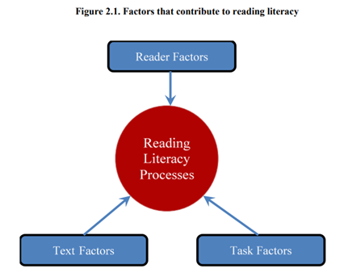
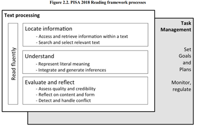
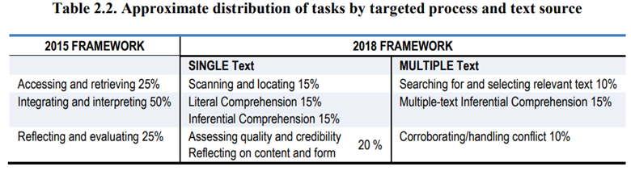
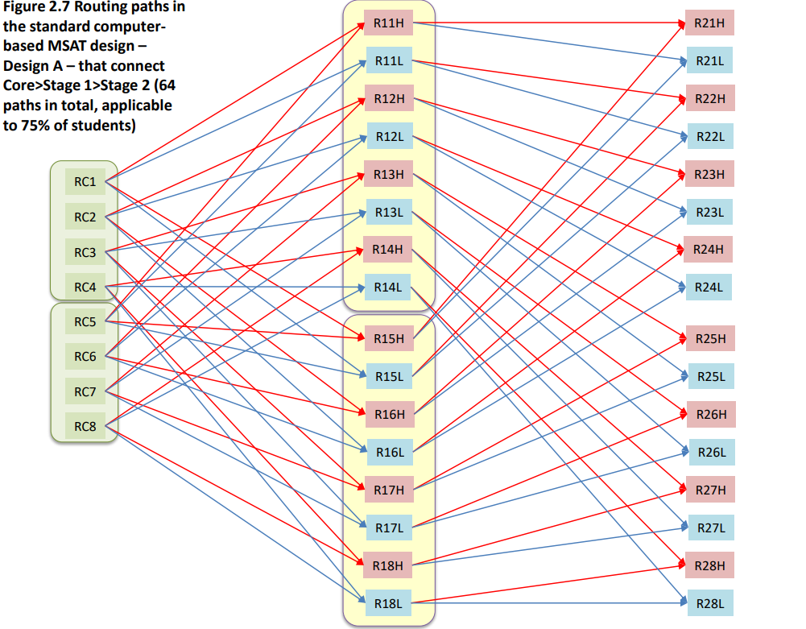
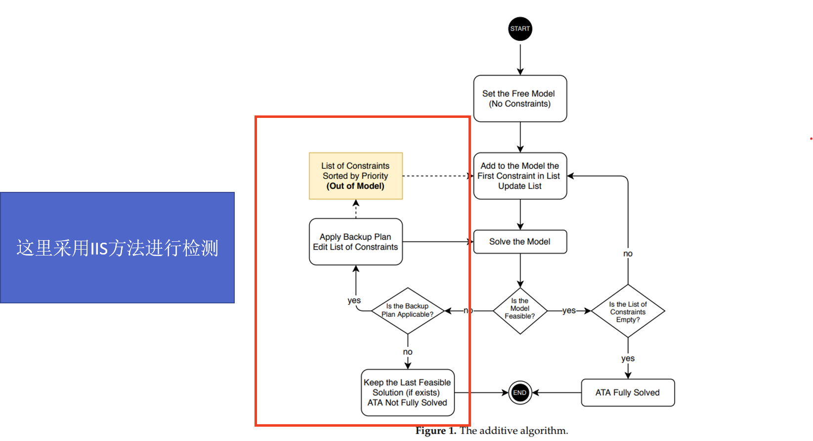

# <a title="ATA Item Bank Thesis" href="[liuliuliufree/ATA_Item_Bank_Thesis (github.com)](https://github.com/liuliuliufree/ATA_Item_Bank_Thesis)" > ATA Item Bank Thesis</a>

## 一、PISA 2018阅读素养MST探究

> ### **Organising the domain 概念框架**
>
> - **阅读素养**：指的是理解、运用、评价、反思和与文本互动的能力，以达成个人目标、拓展知识和潜能，并积极参与社会活动 (Reading literacy is understanding, using, evaluating, reflecting on and engaging with texts in order to achieve one’s goals, to develop one’s knowledge and potential and to participate in society) 
>
> - **促进阅读素养的因素** (Factors that contribute to reading literacy) 
>
>   - **Reader Factors**：阅读时，读者会受到多种因素的影响，比如动机、先前知识以及其他认知能力 (A reader brings a number of reader factors to reading, which can include motivation, prior knowledge, and other cognitive abilities)
>   - **Text Factors**：阅读活动受文本因素的影响，这些因素包括文本的格式、语言的复杂程度以及读者接触到的文本数量 (These factors include the format of the text, the complexity of the language used, and the number of pieces of text a reader encounters) 
>   - **Task Factors**：阅读活动也受任务因素的影响 (即促使读者与文本互动的需求或原因) ，任务因素包括时间等实际限制、任务目标 (例如是为了乐趣阅读、深度理解或快速获取信息) 以及任务的复杂性或数量 (The  reading activity is also a function of task factors (i.e. the requirements or reasons that  motivate the reader's engagement with text). Task factors include the potential time and other practical constraints, the goals of the task (e.g. whether reading for pleasure, reading for deep understanding or skimming for information) and the complexity or number of tasks to be completed) 
>   - **基于以上三者**：根据其个人特点以及对文本和任务因素的感知，读者会运用一系列**阅读素养过程**，以找到并提取信息，并从文本中构建意义以完成任务 (Based on their individual characteristics and their perception of text  and task factors, readers apply a set of **reading literacy processes** in order to locate and  extract information and construct meaning from texts to achieve tasks) 
>   - Note that The PISA cognitive assessment measures reading literacy by manipulating task and text  factors. An additional questionnaire assays some of the reader factors, such as motivation,  disposition and experience.
>
>   
>
> - 在设计 PISA 阅读素养评估时，最重要的两个考虑因素是，一方面要确保**覆盖学生在学校内外阅读的广泛内容和目的**，另一方面要**在文本和任务中呈现自然的难度变化** (In designing the PISA reading literacy assessment, the two most important considerations are, first, to ensure **broad coverage of what students read and for what purposes they read**, both in and outside of school, and, second, to represent **a natural range of difficulty in texts and tasks**) 
>   -  **text**: the range of material that is read; 
>   -  **processes**: the cognitive approach that determines how  readers engage with a text; 
>   -  **scenarios**: the range of broad contexts or purposes for  which reading takes place. 阅读在什么场景中发生
>   -  因此，PISA 阅读素养评估旨在通过改变**文本**的形式 (读材料的范围) 和背景**情境** (阅读发生的目的和背景) 来衡量学生对**阅读过程**的掌握，其中可能包括一个或多个与主题相关的文本 (Thus, the PISA reading literacy assessment aims to measure students’ mastery of **reading processes** (the possible cognitive approaches of readers to a text) by varying the dimensions of **text** (the range of material that is read) and **scenarios** (the range of broad contexts or purposes for which reading takes place) with one or more thematically related texts) 
>
> ### **Assessing reading literacy 如何测量**
>
> - **Scenarios(Tasks)**：学生将在阅读一系列主题相关文本时，需要明确一个总体目的，以完成更高级别的任务，比如回答一些更为综合性的问题或根据文本撰写推荐 (The PISA 2018 assessment will include scenarios in which students are provided an overarching purpose for reading a collection of thematically related texts in order to complete a higher-level task (e.g responding to some larger integrative question or writing a recommendation based on a set of texts)) 
> - **Process(Tasks)**
>
> 
>
> 
>
> - **Factors improving the coverage of the domain(Text)**
>   - Situation：Educational、Occupational、Personal、Public、Multiple
>   - Text Types：Argumentative、Description、Exposition、Instruction、Narrative、Transactional、Multiple
>   - Text format：Continuous texts、Non-continuous texts、Mixed
> - **Response formats(Text)**：
>   - Open response、Simple Multiple Choice、Complex Multiple Choice；
>   - 计分方式有计算机自动评分 (Computer Scored) 与人工评分 (Human Coded) 两种
>- **Factors affecting item difficulty**：task difficulty can be manipulated through the **process** and **text format** variables
> 
> [Learn more on PISA 2018 阅读素养评估](https://www.oecd-ilibrary.org/education/pisa-2018-assessment-and-analytical-framework_5c07e4f1-en)
> 
> [官方给出的一个题目 (S2.09) ](https://pisa2018-questions.oecd.org/platform/index.html?user=&domain=REA&unit=R551-RapaNui&lang=eng-ZZZ)

- 任务对难度的影响：不同的任务不同难度
- Text对难度的影响：
- 三维模型：
	- literacy
	- text
	- process
	- p

看不同的因子在不同的阶段出现的规律

看不同的因子对难度的影响

看每个阶段在不同的因子的分布和规律

关联地观察


### 1. 各个阶段的长度和信息量

#### 1.1 长度

- Core Stage 每个模块题组数量为2  一共5个题组（22个小题），C1.1被用了4次，其他用了3次——-**总项目数7-10左右，自动评分7-9左右**

| Module              | 自动评分项目数 | 总项目数 | 人工评分项目数 | Level 1a | Level 2 | Level 3 | Level 4 | Level 5 |
| ------------------- | -------------- | -------- | -------------- | ------------------- | ------------------- | ------------------- | ------------------- | ------------------- |
| RC1 - ***C1.1 C1.2*** | 9              | 10       | 1              | 1 | 4 | 4 |  | 1 |
| RC2 - ***C1.1 C1.4***     | 7              | 8        | 1              | 1 | 3 | 3 | 1 |  |
| RC3 - ***C1.3 C1.4***     | 7              | 7        | 0              | 1 | 1 | 3 | 2 |  |
| RC4 - ***C1.2  C1.5***     | 9              | 10       | 1              | 3 | 2 | 4 |  | 1 |
| RC5 - ***C1.4 C1.5***    | 7              | 8        | 1              | 3 | 1 | 3 | 1 |  |
| RC6 - ***C1.2 C1.3***     | 9              | 9        | 0              | 1 | 2 | 4 | 1 | 1 |
| RC7 - ***C1.1 C1.3***    | 8              | 9        | 1              |  | 4 | 4 | 1 |  |
| RC8 - ***C1.1 C1.5***     | 8              | 10       | 2              | 2 | 4 | 4 |  |  |

- Stage 1 每个模块题组数量为3 (Number of Items ≈ 5 in each testlet) 一共24个题组（116个小题），每个题组被用了2次——-**总项目数12-16，自动评分8-11左右**

| Module | 自动评分项目数 | 总项目数 |人工评分项目数 |Level 1a |Level 1b |Level 1c |Level 2 |Level 3 |Level 4 |Level 5 |Level 6 |
| ------ | -------------- | -------- | -------------- | ------ | ------ | ------ | ------ | ------ | ------ | ------ | ------ |
| R11H - ***S1.1 S1.3 S1.14*** | 11             | 15       | 4 |1 | | |3 |3 |5 |2 |1 |
| R11L - ***S1.7 S1.8 S1.21*** | 9              | 13       | 4 |1 |2 | |8 |1 |1 | | |
| R12H - ***S1.1 S1.4 S1.5*** | 9              | 14       | 5 |1 | | |2 |4 |5 |1 |1 |
| R12L - ***S1.10 S1.11 S1.19*** | 9              | 15       | 6 |3 | | |5 |4 |3 | | |
| R13H - ***S1.2 S1.6 S1.16*** | 9              | 14       | 5 |5 | | |1 |3 |4 |1 | |
| R13L - ***S1.8 S1.10 S1.12*** | 9              | 14       | 5 |3 |1 | |5 |5 | | | |
| R14H - ***S1.3 S1.6 S1.18*** | 10             | 15       | 5 |3 | | |3 |2 |4 |3 | |
| R14L - ***S1.9 S1.12 S1.23*** | 8              | 15       | 7 |2 |1 |1 |6 |3 |1 | |1 |
| R15H - ***S1.2 S1.13 S1.15*** | 10             | 15       | 5 |4 | | |1 |3 |3 |3 |1 |
| R15L - ***S1.9  S1.19 S1.20*** | 9              | 15       | 6 |4 |2 | |5 |1 |2 | |1 |
| R16H - ***S1.13 S1.16 S1.17*** | 9              | 16       | 7 |2 | | |3 |6 |2 |3 | |
| R16L - ***S1.7 S1.22 S1.23*** | 10             | 16       | 6 |2 |3 |1 |8 |2 | | | |
| R17H - ***S1.4 S1.14 S1.18*** | 10             | 15       | 5 |4 | | |2 |3 |4 |1 |1 |
| R17L - ***S1.20 S1.22 S1.24*** | 10             | 15       | 5 |5 |4 | |4 |2 | | | |
| R18H - ***S1.5 S1.15 S1.17*** | 8              | 12       | 4 | | | |1 |6 |1 |2 |2 |
| R18L - ***S1.11 S1.21 S1.24*** | 8              | 13       | 5 |2 |1 | |5 |2 |3 | | |

- Stage 2 每个模块题组数量为2 (Number of Items ≈ 7 in each testlet) 一共16个题组（106个小题），每个题组被用了2次——-**总项目数12-14**
| Module | 自动评分项目数 | 总项目数 |人工评分项目数 |Level 1a |Level 1b |Level 2 |Level 3 | Level 4 |Level 5 |Level 6 |
| ------ | -------------- | -------- | -------------- | ------ | ------ | ------ | ------ | ------ | ------ | ------ |
| R21H - ***S2.05 S2.09*** | 11             | 14       | 3 | | |3 |3 |4 |3 |1 |
| R21L - ***S2.1 S2.13***| 7              | 12       | 5 |3 | |3 |2 |2 |2 | |
| R22H - ***S2.1 S2.15***| 7              | 12       | 5 |3 | |3 |2 |2 |2 | |
| R22L - ***S2.07 S2.11*** | 10             | 14       | 4 |5 |1 |4 |3 |1 | | |
| R23H - ***S2.05 S2.10*** | 11             | 14       | 3 | | |4 |4 |3 | |3 |
| R23L - ***S2.02 S2.15*** | 10             | 12       | 2 |2 | |7 | |1 |1 |1 |
| R24H - ***S2.02 S2.13*** | 10             | 12       | 2 |2 | |7 | |1 |1 |1 |
| R24L - ***S2.07 S2.12*** | 6              | 13       | 7 |4 |1 |6 |2 | | | |
| R25H - ***S2.06 S2.09*** | 10             | 14       | 4 |1 | |3 |1 |3 |5 |1 |
| R25L - ***S2.03 S2.14*** | 7              | 14       | 7 |1 | |5 |5 | |3 | |
| R26H - ***S2.03 S2.16*** | 7              | 13       | 6 |3 | |3 |3 |1 |2 |1 |
| R26L - ***S2.08 S2.11*** | 12             | 14       | 2 |7 |1 |3 |2 |1 | | |
| R27H - ***S2.06 S2.10*** | 10             | 14       | 4 |1 | |4 |2 |2 |2 |3 |
| R27L - ***S2.04 S2.16*** | 6              | 13       | 7 |3 | |3 | |3 |3 |1 |
| R28H - ***S2.04 S2.14*** | 6              | 14       | 8 |1 | |5 |2 |2 |4 | |
| R28L - ***S2.08 S2.12*** | 8              | 13       | 5 |6 |1 |5 |1 | | | |

#### 1.2 信息量

- Core Stage：在theta=0的位置，平均达到0.4以上

<div style="display: flex;">
    
    
</div>


- Stage 1：在theta=-0.5和0.5的位置，平均达到0.4以上
<div style="display: flex;">
    
    
</div>


- Stage 2：在theta=-0.5和0.5的位置，平均达到0.4以上
<div style="display: flex;">
    
    
</div>


### 2. 不同的因子对难度的影响

> 通过item map的方式将水平划分为8部分，由低到高依次为Level 1c、Level 1b、Level 1a、 Level 2、Level 3、Level 4、Level 5、Level 6   

| Level           | What Students Can Do                                         |
| --------------- | ------------------------------------------------------------ |
| 6 689 1.1%      | 6级读者通常能够做出多重推断、比较和对比，这些推断、比较和对比都非常详细和准确。他们对一个或多个文本有着全面而详细的理解，可能会从多个文本中**整合信息**。任务可能需要读者在处理陌生观念的同时，面对突出的竞争性信息，并为解释产生抽象的类别。学生可以对陌生话题上的复杂文本进行假设或批判性评估，考虑多个标准或观点，并运用超越文本的复杂理解。在这一级别获取和检索任务的一个显著条件是分析的精确性和对细节的细致注意，这在文本中并不明显。 |
| 5 626 8.4%      | 5 级读者能够找到并整理几个深度嵌入的信息片段，推断文本中哪些信息是相关的。反思性任务需要对文本进行批判性评估或假设推断，并依赖于专业知识。解释和反思任务都要求对内容或形式不熟悉的文本有全面详细的理解。在阅读的各个方面上，这个级别的任务通常涉及处理与预期相悖的概念。 |
| 4 553 29.5%     | 4级读者能够找到并整理多个嵌入式信息片段。他们还能够通过全文来理解文段中的语言细微差异。在其他任务中，学生展示了对陌生背景下类别的理解和运用能力。此外，这个级别的学生可以利用正式或公共知识对文本进行假设或批判性评价。读者必须准确理解内容或形式可能陌生的长篇或复杂文本。 |
| **3 480 58.6%** | 3级读者能够找到，并有时能够认识到，多个信息之间满足多个条件的关系。他们还可以整合文本的几个部分，以确定主要观点，理解关系或理解一个词语或短语的含义。他们需要考虑到在比较、对比或分类时的许多特征。通常所需的信息并不显眼，或者存在许多竞争的信息；或者存在其他文本障碍，比如与预期相反或负面措辞的想法。在这个水平上反映的任务可能需要连接、比较和解释，或者可能需要读者评估文本的某个特征。一些反思性任务要求读者对文本与熟悉的日常知识之间的关系有深入的理解。其他任务不需要详细的文本理解，但需要读者利用不太常见的知识。 |
| 2 407 82.0%     | 2级的读者可以找到文本中的一项或多项信息，这些信息可能需要推断，也可能需要满足多个条件。当信息并不显眼时，读者必须进行较低水平的推断才能理解文本的主要观点、理解关系或推断含义，可能需要进行基于文本中单一特征的比较或对比。在这个级别，典型的反思性任务要求读者根据个人经验和态度，将文本与外部知识进行比较或建立联系。 |
| 1a 335 94.3%    | 1a 级的读者能够找到一两个明确陈述的信息片段；他们可以理解关于熟悉话题的文本的主题或作者的目的，或者将文本中的信息与日常常识简单地联系起来。通常，文本中所需的信息很明显，几乎没有其他干扰性的信息。学生被明确要求考虑任务和文本中的相关因素。 |
| 1b 262 98.7%    | 在简单易懂的文本中，1b 级读者可以很容易地找到一个重要信息，比如叙述性文章或简单列表中的一个明确陈述的内容。1b 级任务中的文本通常给予读者一定的支持，比如重复提及信息、插入图片或使用熟悉的符号。这类文本中竞争的信息很少。1b 级读者可以通过简单地连接文本中相邻的信息来理解其含义。 |
| 1c 低于1b       |                                                              |


| level1c | level1b | level1a | level2 | level3 | level4 | level5 | level6 |
| ------- | ------- | ------- | ------ | ------ | ------ | ------ | ------ |
| 1       | 9       | 46      | 71     | 50     | 34     | 23     | 10     |


| Search and select  relevant text  | 19   |
| --------------------------------- | ---- |
| Scan and locate                   | 30   |
| Represent literal meaning         | 53   |
| Reflect on content and form       | 38   |
| Integrate and generate inferences | 78   |
| Corroborate and handle conflict   | 18   |
| Assess quality and credibility    | 8    |

#### 2.1 Process and Text  Structure of Unit

- 无明显的难度分布差异，和整个题库中不同水平的的题目数量分布差不多，这一整个题库质量很高

**Multiple** 140

| 任务                          | 任务                                  | 出现的难度水平                                               |
| ----------------------------- | ------------------------------------- | ------------------------------------------------------------ |
| **Locating information**      | Scan and locate 13                    | level1b 2，level1a 3，level2 4，level3 1，level4 1，level5 1，level6 1 |
|                               | Search and select relevant  text 18   | level1b 1，level1a 4，level2 2，level3 8，level4 3           |
| **Understanding**             | Represent literal meaning 24          | level1b 3，level1a 6，level2 7，level3 6，level4 1，level6 1 |
|                               | Integrate and generate  inferences 38 | level1b 1，level1a 9，level2 14，level3 3，level4 7，level5 4 |
| **Evaluating and reflecting** | Assess quality and  credibility 8     | level2 2，level3 2，level4 1，level5 2，level6 1             |
|                               | Reflect on content and  form 21       | level1a 5，level2 5，level3 6，level4 2，level5 2，level6 1  |
|                               | Corroborate and handle  conflict 18   | level1a 1，level2 3，level3 1，level4 7，level5 3，level6 3  |

**Single** 104

| 任务                          | 任务                                  | 出现的难度水平                                               |
| ----------------------------- | ------------------------------------- | ------------------------------------------------------------ |
| **Locating information**      | Scan and locate 17                    | level1b 1，level1a 5，level2 6，level3 2，level4 1，level5 1，level6 1 |
|                               | Search and select relevant  text 1    | level4 1，                                                   |
| **Understanding**             | Represent literal meaning  29         | level1c 1，level1a 7，level2 7，level3 7，level4 2，level5 4，level6 1 |
|                               | Integrate and generate  inferences 40 | level1b 1，level1a 4，level2 14，level3 9，level4 6，level5 5，level6 1 |
| **Evaluating and reflecting** | Reflect on content and  form 17       | level1a 2，level2 7，level3 5，level4 2，level5 1            |


#### 2.2 Process and Text format

- 无明显的难度分布差异，和整个题库中不同水平的的题目数量分布差不多

**Continuous** 158

| 任务                          | 任务                                  | 出现的难度水平                                               |
| ----------------------------- | ------------------------------------- | ------------------------------------------------------------ |
| **Locating information**      | Scan and locate 17                    | level1b 1，level1a 6，level2 6，level3 1，level4 1，level5 1，level6 1 |
|                               | Search and select relevant  text 4    | level3 3，level4 1                                           |
| **Understanding**             | Represent literal meaning 45          | level1c 1，level1b 3，level1a 11，level2 11，level3 13，level4 2，level5 2，level6 2 |
|                               | Integrate and generate  inferences 48 | level1b 1，level1a 7，level2 18，level3 8，level4 7，level5 6，level6 1 |
| **Evaluating and reflecting** | Assess quality and  credibility 6     | level2 2，level3 1，level5 2，level6 1                       |
|                               | Reflect on content and  form 27       | level1a 5，level2 8，level3 8，level4 3，level5 2，level6 1  |
|                               | Corroborate and handle  conflict 11   | level2 2，level4 4，level5 2，level6 3                       |

**Non-continuous** 30

| 任务                          | 任务                                 | 出现的难度水平                                               |
| ----------------------------- | ------------------------------------ | ------------------------------------------------------------ |
| **Locating information**      | Scan and locate 10                   | level1b 2，level1a 2，level2 2，level3 1，level4 1，level5 1，level6 1 |
|                               | Search and select relevant  text 6   | level1a 1，level2 1，level3 2，level4 2                      |
| **Understanding**             | Represent literal meaning 4          | level2 2，level4 1，level5 1                                 |
|                               | Integrate and generate  inferences 8 | level1a 2，level2 3，level3 1，level4 2                      |
| **Evaluating and reflecting** |                                      |                                                              |
|                               | Reflect on content and  form 2       | level3 1，level4 1                                           |
|                               |                                      |                                                              |

**Mixed** 56

| 任务                          | 任务                                  | 出现的难度水平                                               |
| ----------------------------- | ------------------------------------- | ------------------------------------------------------------ |
| **Locating information**      | Scan and locate 3                     | level2 2，level3 1                                           |
|                               | Search and select relevant  text 9    | level1b 1，level1a 3，level2 1，level3 3，level4 1           |
| **Understanding**             | Represent literal meaning 4           | level1a 2，level2 1，level5 1                                |
|                               | Integrate and generate  inferences 22 | level1b 1，level1a 4，level2 7，level3 3，level4 4，level5 3 |
| **Evaluating and reflecting** | Assess quality and  credibility 2     | level3 1，level4 1                                           |
|                               | Reflect on content and  form 9        | level1a 2，level2 4，level3 2，level5 1                      |
|                               | Corroborate and handle  conflict 7    | level1a 1，level2 1，level3 1，level4 3，level5 1            |


#### 2.3 Text format

- 各种Text format均有各种难度的题目出现

| Continuous     |      |
| -------------- | ---- |
| Non-continuous |      |
| Mixed          |      |

#### 2.4 Text type

- 各种Text type均有各种难度的题目出现

| Argumentative 议论文 |      |
| -------------------- | ---- |
| Description  说明    |      |
| Exposition 论述      |      |
| Instruction 教学     |      |
| Multiple             |      |
| Narrative 叙事       |      |
| Transactional 事务性 |      |

#### 2.5 Item format

- 各种 Item format均有各种难度的题目出现

| Simple Multiple  Choice  |      |
| ------------------------ | ---- |
| Complex Multiple  Choice |      |
| Open Response            |      |

#### 2.6 Situation

- 各种situation均有各种难度的题目出现

| Situation    | 出现的难度水平 |
| ------------ | -------------- |
| Public       |                |
| Personal     |                |
| Multiple     |                |
| Educational  |                |
| Occupational |                |


### 3. 不同的因子在不同的阶段出现的规律

####  3.1 Core Stage

- 用于构建本阶段的题组共有5个，共有22个小题：其中level1a的题目有4个，level2的题目有6个，level3的题目有9个，level4的题目有2个，level5的题目有1个

- 难度等级主要集中在、level2、level3**，在core阶段各个模块的题目水平分布也是如此 即较简单的题数量较多

- level2、level3的题目总和占比需要达到70%及以上

- 

- | Module                 | Level 1a | Level 2 | Level 3 | Level 4 | Level 5 |
	| ---------------------- | -------- | ------- | ------- | ------- | ------- |
	| RC1 - ***C1.1 C1.2***  | 1        | 4       | 4       |         | 1       |
	| RC2 - ***C1.1 C1.4***  | 1        | 3       | 3       | 1       |         |
	| RC3 - ***C1.3 C1.4***  | 1        | 1       | 3       | 2       |         |
	| RC4 - ***C1.2  C1.5*** | 3        | 2       | 4       |         | 1       |
	| RC5 - ***C1.4 C1.5***  | 3        | 1       | 3       | 1       |         |
	| RC6 - ***C1.2 C1.3***  | 1        | 2       | 4       | 1       | 1       |
	| RC7 - ***C1.1 C1.3***  |          | 4       | 4       | 1       |         |
	| RC8 - ***C1.1 C1.5***  | 2        | 4       | 4       |         |         |

- 

	

- | Complex  Multiple Choice | 1    |
	| ------------------------ | ---- |
	| Complex Multiple Choice  | 1    |
	| Open Response            | 3    |
	| Simple Multiple Choice   | 11   |
	| Simple Multiple Choice   | 6    |

- | Argumentative | 8    |
	| ------------- | ---- |
	| Description   | 1    |
	| Exposition    | 11   |
	| Multiple      | 2    |

- | Educational | 13   |
	| ----------- | ---- |
	| Public      | 9    |

- | Continuous     | 17   |
	| -------------- | ---- |
	| Mixed          | 2    |
	| Non-continuous | 3    |

- | Corroborate  and handle conflict   | 1    |
	| ---------------------------------- | ---- |
	| Integrate and generate  inferences | 6    |
	| Reflect on content and form        | 5    |
	| Represent literal meaning          | 8    |
	| Scan and locate                    | 1    |
	| Search and select relevant  text   | 1    |

#### 3.2 Stage 1

- 用于构建本阶段的题组共有24个，共有116个小题，各个难度的分布如下

- | Level 1c | Level 1b | Level 1a | Level 2 | Level 3 | Level 4 | Level 5 | Level 6 |
	| -------- | -------- | -------- | ------- | ------- | ------- | ------- | ------- |
	| 1        | 7        | 21       | 31      | 25      | 19      | 8       | 4       |

- 

- | Assess  quality and credibility    | 3    |
	| ---------------------------------- | ---- |
	| Corroborate and handle  conflict   | 11   |
	| Integrate and generate  inferences | 32   |
	| Reflect on content and form        | 18   |
	| Represent literal meaning          | 18   |
	| Scan and locate                    | 14   |
	| Search and select relevant  text   | 10   |

- H：S1.1 ~ S1.6、S1.13~S1.18

- | Module                         | Level 1a | Level 1b | Level 1c | Level 2 | Level 3 | Level 4 | Level 5 | Level 6 |
	| ------------------------------ | -------- | -------- | -------- | ------- | ------- | ------- | ------- | ------- |
	| R11H - ***S1.1 S1.3 S1.14***   | 1        |          |          | 3       | 3       | 5       | 2       | 1       |
	| R12H - ***S1.1 S1.4 S1.5***    | 1        |          |          | 2       | 4       | 5       | 1       | 1       |
	| R13H - ***S1.2 S1.6 S1.16***   | 5        |          |          | 1       | 3       | 4       | 1       |         |
	| R14H - ***S1.3 S1.6 S1.18***   | 3        |          |          | 3       | 2       | 4       | 3       |         |
	| R15H - ***S1.2 S1.13 S1.15***  | 4        |          |          | 1       | 3       | 3       | 3       | 1       |
	| R16H - ***S1.13 S1.16 S1.17*** | 2        |          |          | 3       | 6       | 2       | 3       |         |
	| R17H - ***S1.4 S1.14 S1.18***  | 4        |          |          | 2       | 3       | 4       | 1       | 1       |
	| R18H - ***S1.5 S1.15 S1.17***  |          |          |          | 1       | 6       | 1       | 2       | 2       |

- L：S1.7 ~ S1.12、S1.19 ~ S1.24

- 

- | Module                         | Level 1a | Level 1b | Level 1c | Level 2 | Level 3 | Level 4 | Level 5 | Level 6 |
	| ------------------------------ | -------- | -------- | -------- | ------- | ------- | ------- | ------- | ------- |
	| R11L - ***S1.7 S1.8 S1.21***   | 1        | 2        |          | 8       | 1       | 1       |         |         |
	| R12L - ***S1.10 S1.11 S1.19*** | 3        |          |          | 5       | 4       | 3       |         |         |
	| R13L - ***S1.8 S1.10 S1.12***  | 3        | 1        |          | 5       | 5       |         |         |         |
	| R14L - ***S1.9 S1.12 S1.23***  | 2        | 1        | 1        | 6       | 3       | 1       |         | 1       |
	| R15L - ***S1.9  S1.19 S1.20*** | 4        | 2        |          | 5       | 1       | 2       |         | 1       |
	| R16L - ***S1.7 S1.22 S1.23***  | 2        | 3        | 1        | 8       | 2       |         |         |         |
	| R17L - ***S1.20 S1.22 S1.24*** | 5        | 4        |          | 4       | 2       |         |         |         |
	| R18L - ***S1.11 S1.21 S1.24*** | 2        | 1        |          | 5       | 2       | 3       |         |         |


| Module                         | Level 1a | Level 1b | Level 1c | Level 2 | Level 3 | Level 4 | Level 5 | Level 6 |
| ------------------------------ | -------- | -------- | -------- | ------- | ------- | ------- | ------- | ------- |
| R11H - ***S1.1 S1.3 S1.14***   | 1        |          |          | 3       | 3       | 5       | 2       | 1       |
| R11L - ***S1.7 S1.8 S1.21***   | 1        | 2        |          | 8       | 1       | 1       |         |         |
| R12H - ***S1.1 S1.4 S1.5***    | 1        |          |          | 2       | 4       | 5       | 1       | 1       |
| R12L - ***S1.10 S1.11 S1.19*** | 3        |          |          | 5       | 4       | 3       |         |         |
| R13H - ***S1.2 S1.6 S1.16***   | 5        |          |          | 1       | 3       | 4       | 1       |         |
| R13L - ***S1.8 S1.10 S1.12***  | 3        | 1        |          | 5       | 5       |         |         |         |
| R14H - ***S1.3 S1.6 S1.18***   | 3        |          |          | 3       | 2       | 4       | 3       |         |
| R14L - ***S1.9 S1.12 S1.23***  | 2        | 1        | 1        | 6       | 3       | 1       |         | 1       |
| R15H - ***S1.2 S1.13 S1.15***  | 4        |          |          | 1       | 3       | 3       | 3       | 1       |
| R15L - ***S1.9  S1.19 S1.20*** | 4        | 2        |          | 5       | 1       | 2       |         | 1       |
| R16H - ***S1.13 S1.16 S1.17*** | 2        |          |          | 3       | 6       | 2       | 3       |         |
| R16L - ***S1.7 S1.22 S1.23***  | 2        | 3        | 1        | 8       | 2       |         |         |         |
| R17H - ***S1.4 S1.14 S1.18***  | 4        |          |          | 2       | 3       | 4       | 1       | 1       |
| R17L - ***S1.20 S1.22 S1.24*** | 5        | 4        |          | 4       | 2       |         |         |         |
| R18H - ***S1.5 S1.15 S1.17***  |          |          |          | 1       | 6       | 1       | 2       | 2       |
| R18L - ***S1.11 S1.21 S1.24*** | 2        | 1        |          | 5       | 2       | 3       |         |         |

#### 3.3 Stage 2

- 用于构建本阶段的题组共有16个，共有106个小题，各个难度的题分布如下：

- 

- | Level 1b | Level 1a | Level 2 | Level 3 | Level 4 | Level 5 | Level 6 |
	| -------- | -------- | ------- | ------- | ------- | ------- | ------- |
	| 2        | 21       | 34      | 16      | 13      | 14      | 6       |

- H：

	| Module                   | Level 1a | Level 1b | Level 2 | Level 3 | Level 4 | Level 5 | Level 6 |
	| ------------------------ | -------- | -------- | ------- | ------- | ------- | ------- | ------- |
	| R21H - ***S2.05 S2.09*** |          |          | 3       | 3       | 4       | 3       | 1       |
	| R22H - ***S2.1 S2.15***  | 3        |          | 3       | 2       | 2       | 2       |         |
	| R23H - ***S2.05 S2.10*** |          |          | 4       | 4       | 3       |         | 3       |
	| R24H - ***S2.02 S2.13*** | 2        |          | 7       |         | 1       | 1       | 1       |
	| R25H - ***S2.06 S2.09*** | 1        |          | 3       | 1       | 3       | 5       | 1       |
	| R26H - ***S2.03 S2.16*** | 3        |          | 3       | 3       | 1       | 2       | 1       |
	| R27H - ***S2.06 S2.10*** | 1        |          | 4       | 2       | 2       | 2       | 3       |
	| R28H - ***S2.04 S2.14*** | 1        |          | 5       | 2       | 2       | 4       |         |

- L：

	| Module                   | Level 1a | Level 1b | Level 2 | Level 3 | Level 4 | Level 5 | Level 6 |
	| ------------------------ | -------- | -------- | ------- | ------- | ------- | ------- | ------- |
	| R21L - ***S2.1 S2.13***  | 3        |          | 3       | 2       | 2       | 2       |         |
	| R22L - ***S2.07 S2.11*** | 5        | 1        | 4       | 3       | 1       |         |         |
	| R23L - ***S2.02 S2.15*** | 2        |          | 7       |         | 1       | 1       | 1       |
	| R24L - ***S2.07 S2.12*** | 4        | 1        | 6       | 2       |         |         |         |
	| R25L - ***S2.03 S2.14*** | 1        |          | 5       | 5       |         | 3       |         |
	| R26L - ***S2.08 S2.11*** | 7        | 1        | 3       | 2       | 1       |         |         |
	| R27L - ***S2.04 S2.16*** | 3        |          | 3       |         | 3       | 3       | 1       |
	| R28L - ***S2.08 S2.12*** | 6        | 1        | 5       | 1       |         |         |         |


| Module                   | Level 1a | Level 1b | Level 2 | Level 3 | Level 4 | Level 5 | Level 6 |
| ------------------------ | -------- | -------- | ------- | ------- | ------- | ------- | ------- |
| R21H - ***S2.05 S2.09*** |          |          | 3       | 3       | 4       | 3       | 1       |
| R21L - ***S2.1 S2.13***  | 3        |          | 3       | 2       | 2       | 2       |         |
| R22H - ***S2.1 S2.15***  | 3        |          | 3       | 2       | 2       | 2       |         |
| R22L - ***S2.07 S2.11*** | 5        | 1        | 4       | 3       | 1       |         |         |
| R23H - ***S2.05 S2.10*** |          |          | 4       | 4       | 3       |         | 3       |
| R23L - ***S2.02 S2.15*** | 2        |          | 7       |         | 1       | 1       | 1       |
| R24H - ***S2.02 S2.13*** | 2        |          | 7       |         | 1       | 1       | 1       |
| R24L - ***S2.07 S2.12*** | 4        | 1        | 6       | 2       |         |         |         |
| R25H - ***S2.06 S2.09*** | 1        |          | 3       | 1       | 3       | 5       | 1       |
| R25L - ***S2.03 S2.14*** | 1        |          | 5       | 5       |         | 3       |         |
| R26H - ***S2.03 S2.16*** | 3        |          | 3       | 3       | 1       | 2       | 1       |
| R26L - ***S2.08 S2.11*** | 7        | 1        | 3       | 2       | 1       |         |         |
| R27H - ***S2.06 S2.10*** | 1        |          | 4       | 2       | 2       | 2       | 3       |
| R27L - ***S2.04 S2.16*** | 3        |          | 3       |         | 3       | 3       | 1       |
| R28H - ***S2.04 S2.14*** | 1        |          | 5       | 2       | 2       | 4       |         |
| R28L - ***S2.08 S2.12*** | 6        | 1        | 5       | 1       |         |         |         |

###  4. PISA的目的

#### 4.1 一方面要确保**覆盖学生在学校内外阅读的广泛内容和目的**

- 一条路径上所需满足的各个属性的分布
	- Text Type：大多数题组只有1/2个Text Type，一条路径只有5个题组，**规定每条路径必须达到6钟不同的Text Type**
	- Situation：约3/4的题组只有一个situation，一条路径只有5个题组，因此最多覆盖5个/6个situation，**规定每条路径必须达到5钟不同的Situation**
	- Process：每一个题组会考察至少3种能力，最多考察题组题目数量的能力数，**规定每条路径必须需要考察7种不同的能力**
	- Item format：Simple Choice、Complex Choice、Open Response（也仅仅是这种类型的是人工评分的）
		- Core Stage：**每一个模块由2个题组组成，总项目数7-10，自动评分项目在7-9**
		- Stage1：**每个模块题组数量为3，总项目数12-16，自动评分8-11左右**
		- Stage2：**每个模块题组数量为2，总项目数12-14，无自动评分约束**
		- **总项目数>=35，Simple Choice>=18且<=24**
	- Text  Structure of Unit：除了S2.16之外，其他所有题组都只有一种Text format，依据这个题库的特性，肯定可以满足约束，因此不对其添加约束

#### 4.2 一方面要**在文本和任务中呈现自然的难度变化**

- 每个题组最多被使用两次

- core stage：level2、level3的题目总和占比需要达到70%及以上，不能出现level6的题目 theta = 0
- Stage 1 
  - H：不能出现Leve1b、Level1c的题，Level3+Level4+Level5的题目总和占比需要达到70%及以上 theta = 0.5
  - L：可以出现Leve1b、Level1c的题，Level1a+Level2+Level3的题目总和占比需要达到70%及以上，不能出现level6的题目 theta = -0.5
- Stage 2
  - H：不能出现Leve1b、Level1c的题，Level3+Level4+Level5的题目总和占比需要达到70%及以上 theta = 0.5
  - L：可以出现Leve1b、Level1c的题，Level1a+Level2+Level3的题目总和占比需要达到70%及以上，不能出现level6的题目 theta = -0.5

#### 4.3 路由所需达到的信息量

依据上面的规定其实已经规定了难度锚点在什么地方，只需要再规定一下所需达到的最小信息量即可

## 二、模型构建

### 1. MST结构设计

#### 1.1 PISA的结构如下



#### 1.2 本研究拟采用的结构如下

4个1-2-2的面板，共16条路径

### 2. 模型

#### 2.0 定义变量

测验变量：
$$
T_t \quad \text{pannel t, t} \in {1, 2, 3, 4}
$$


决策变量：
$$
x_i \quad \text{item i}\\
s_i \quad \text{testlet i}
$$

项目水平属性：
$$
q_{i,j}  \quad (\text{item i's info at }\theta_j) \\
f_i \quad (1=\text{Compputer scored; }0=\text{Human coded}) \\
p_i \quad (\text{item i's process }) \\
s_i \quad (\text{item i's situation}) \\
if_i \quad (\text{item i's item format}) \\
tt_i \quad (\text{item i's text type})
$$

#### 2.1 一个面板例如$T_t$

- 将五个模块(Core Stage、Stage1H、Stage1L、Stage2H、Stage2L)看作是5个测验$m$

	- Multiple-Module Level
		$$
		\sum_{m=1}^5s_{im}\leq1,\quad\text{for all }m;\quad\text{(no overlap)}
		$$

	- Module Level

		- Core Stage: $m=1$
			$$
			\sum_{i=1}^{45}s_{i1}= 2\quad\text{(teselet number)}\\
			7 \leq \sum_{i=1}^{45}n1_is_{i1}  \leq 10 \quad\text{(item number)}\\
			7 \leq \sum_{i=1}^{45}n2_is_{i1} \leq 9 \quad\text{(computer scored item number)}\\
			\sum_{i=1}^{45}(l2_i+l3_i)s_{i1} \geq 0.7\cdot \sum_{i=1}^{45}(l1c_i+l1b_i+l1a_i+l2_i+l3_i+l4_i+l5_i+l6_i)s_{i1} \quad\text{(level attribute ratio)}
			$$

		- Stage1H: $m=2$
			$$
			\sum_{i=1}^{45}s_{i2}= 3\quad\text{(teselet number)}\\
			12 \leq \sum_{i=1}^{45}n1_is_{i2}  \leq 16 \quad\text{(item number)}\\
			8 \leq \sum_{i=1}^{45}n2_is_{i2} \leq 11 \quad\text{(computer scored item number)}\\
			\sum_{i=1}^{45}(l1c_i+l1b_i)s_{i2} = 0\\
			\sum_{i=1}^{45}(l3_i+l4_i+l5_i)s_{i2} \geq 0.7\cdot \sum_{i=1}^{45}(l1c_i+l1b_i+l1a_i+l2_i+l3_i+l4_i+l5_i+l6_i)s_{i2} \quad\text{(level attribute ratio)}
			$$
			
		- Stage1L: $m=3$
			$$
			\sum_{i=1}^{45}s_{i3}= 3\quad\text{(teselet number)}\\
			12 \leq \sum_{i=1}^{45}n1_is_{i3}  \leq 16 \quad\text{(item number)}\\
			8 \leq \sum_{i=1}^{45}n2_is_{i3} \leq 11 \quad\text{(computer scored item number)}\\
			\sum_{i=1}^{45}(l1a_i+l2_i+l3_i)s_{i3} \geq 0.7\cdot \sum_{i=1}^{45}(l1c_i+l1b_i+l1a_i+l2_i+l3_i+l4_i+l5_i+l6_i)s_{i3} \quad\text{(level attribute ratio)}
			$$
			
		- Stage2H: $m=4$
			$$
			\sum_{i=1}^{45}s_{i1}= 2\quad\text{(teselet number)}\\
			12 \leq \sum_{i=1}^{45}n1_is_{i1}  \leq 14 \quad\text{(item number)}\\
			
			\sum_{i=1}^{45}(l1c_i+l1b_i)s_{i4} = 0\quad\text{(level attribute ratio)}\\
			\sum_{i=1}^{45}(l3_i+l4_i+l5_i)s_{i4} \geq 0.7\cdot \sum_{i=1}^{45}
			(l1c_i+l1b_i+l1a_i+l2_i+l3_i+l4_i+l5_i+l6_i)s_{i4} \quad\text{(level attribute ratio)}\\
			$$
		
		- Stage2L: $m=5$
			$$
			\sum_{i=1}^{45}s_{i1}= 2\quad\text{(teselet number)}\\
			12 \leq \sum_{i=1}^{45}n1_is_{i1}  \leq 14 \quad\text{(item number)}\\
			\sum_{i=1}^{45}(l1a_i+l2_i+l3_i)s_{i5} \geq 0.7\cdot \sum_{i=1}^{45}(l1c_i+l1b_i+l1a_i+l2_i+l3_i+l4_i+l5_i+l6_i)s_{i5} \quad\text{(level attribute ratio)}
			$$
			
		
	- Definition of Variables
		$$
		\begin{aligned}s_{it}\in\{0,1\},\quad\text{for all }i\text{ and }t.\quad\text{(range of variables)}\end{aligned}
		$$
	
- Path Level：将上述求得的结果进行转化，并判断每条路径是否符合如下规则：
	$$
	(t1_i+t2_i+t3_i+t4_i+t5_i+t6_i+t7_i)p_{i}\geq 5\quad\text{(Text Type)}\\
	(s1_i+s2_i+s3_i+s4_i+s5_i)p_{i}\geq 4\quad\text{(Situation)}\\
	(cp1_i+cp2_i+cp3_i+cp4_i+cp5_i+cp6_i+cp7_i)p_{i}\geq 6\quad\text{(Congnitive Process)}\\
	\begin{aligned}p_{i} = 1,\quad\text{for all }i \in\{1,2,3,4,5\}.\quad\text{(range of variables)}\end{aligned}
	$$

#### 2.2 所有面板(关于IIS的可以用gurobi实现)


## 三、研究一与研究二

提示与最佳实践 提前筛查可能引起问题的约束和限制

**为了减小问题规模并增进结果的解释性，在进行计算 IIS 例程或可行性放松之前，先定义一个潜在问题约束和限制的清单是很有帮助的。在扩展这个潜在问题约束和限制的清单时，**有几个标准要考虑：

- 受到数据变化影响的约束和限制，
- 基于用户输入的约束和限制，
- 在模型开发期间最近修改的约束和限制。

一旦您有了这个潜在问题约束和限制的清单，您可以指定：

- 对于 'compute IIS'，不在列表中的约束和限制不符合被包括在 IIS 中的条件，使用 ISConstrForce、IISLBForce、IISUBForce、IISSOSForce、IISQConstrForce 和 IISGenConstrForce 属性，
- 对于可行性放松，只有列表中的约束和限制在使用 Model.feasRelax() 时符合放松条件，通过使用 vars 和 constrs 参数。这两个参数控制哪些变量的边界允许被违反以及哪些线性约束允许被违反。您还可以利用 IIS 的结果来获得潜在问题约束和限制的清单。


基于加法策略进行求解运算以及IIS算法进行求解运算，即类似于上面说的，**定义一个潜在问题约束和限制的清单**




- 限制条件的优先层级（分块设置优先层级，而非原文中的一个一个来设置，太多了根本设置不过来）：
	- 1
	- 2

- 如何放松，对指定的约束进行放松：

	- [Model.feasRelax() - Gurobi Optimization](https://www.gurobi.com/documentation/current/refman/py_model_feasrelax.html)

	- [How do I change variable and/or constraint bounds to make an infeasible model feasible using feasRelax? – Gurobi Help Center](https://support.gurobi.com/hc/en-us/articles/8444209982737-How-do-I-change-variable-and-or-constraint-bounds-to-make-an-infeasible-model-feasible-using-feasRelax)

	- [利用gurobi分析不可行（infeasible）模型_gurobi模型不可行-CSDN博客](https://blog.csdn.net/zhanghuaren2003/article/details/135266922)

所谓松弛变量法

- 参考代码1

```python
import gurobipy as gp

# 读取原来的不可行模型
feasmodel = gp.read("model_file.lp")

# clear objective
feasmodel.setObjective(0.0)

# add slack variables
# 对原来的约束松弛化
for c in feasmodel.getConstrs():
    sense = c.Sense
    if sense != '>':
        feasmodel.addVar(obj=1.0, name="ArtN_" + c.ConstrName,
                         column=gp.Column([-1], [c]))
    if sense != '<':
        feasmodel.addVar(obj=1.0, name="ArtP_" + c.ConstrName,
                         column=gp.Column([1], [c]))

# optimize modified model
feasmodel.setParam('MIPGap', 0.05)
feasmodel.optimize()
feasmodel.write('feasopt.lp')
feasmodel.write('feasopt.sol')

# 现在可以找到sol文件中松弛变量（以ArtN_或者ArtP_开头）， 关注取值不是0的变量， 结合feasopt.lp 来看， 到底是哪些约束存在冲突。
```

- 参考代码2 `Model.feasRelax(relaxobjtype, minrelax, vars, lbpen, ubpen, constrs, rhspen)`

​	**Arguments:**

​	**relaxobjtype**: The cost function used when finding the minimum cost relaxation.

​	**minrelax**: The type of feasibility relaxation to perform.

​	**vars**: Variables whose bounds are allowed to be violated.

​	**lbpen**: Penalty for violating a variable lower bound. One entry for each variable in argument vars.

​	**ubpen**: Penalty for violating a variable upper bound. One entry for each variable in argument vars.

​	**constrs**: Linear constraints that are allowed to be violated.

​	**rhspen**: Penalty for violating a linear constraint. One entry for each constraint in argument constrs.

​	**Return value:**

​	Zero if minrelax is False. If minrelax is True, the return value is the objective value for the relaxation performed. If the value is less than 0, it indicates that the method failed to create the feasibility relaxation.


存在两种类型的约束：

1、线性约束

2、Indicator 函数约束   可用`model.setParam(GRB.Param.IISGenConstrForce, 0) # 不考虑indicator约束`将这类约束在计算IIS时不考虑它们


约束的重要程度：

- essential 
	- 每个模块必须打不同level的题目占比
		- Core
		- Stage 1H
		- Stage 1L
		- Stage 2H
		- Stage 2L
	- 每个模块所需达到的信息量
- High
	- Process
	- Situation
	- Text Type
- Median
	- Item format


Item format：Simple Choice、Complex Choice、Open Response（也仅仅是这种类型的是人工评分的）

- Core Stage：**每一个模块由2个题组组成，总项目数7-10，自动评分项目在7-9**
- Stage1：**每个模块题组数量为3，总项目数12-16，自动评分8-11左右**
- Stage2：**每个模块题组数量为2，总项目数12-14，无自动评分约束**
- **总项目数>=35，Simple Choice>=18且<=24**


|              |     Core_Stage |            Stage_1H |             Stage_1L |      Stage_2H | Stage_2L      |
| -----------: | -------------: | ------------------: | -------------------: | ------------: | ------------- |
| assignPanal1 | [S1_10, S2_15] | [C1_3, S1_6, S1_13] | [C1_4, S1_20, S1_24] | [S2_9, S2_11] | [S1_4, S2_8]  |
| assignPanal2 |   [C1_1, S1_8] |  [S1_1, S1_3, S1_5] | [C1_2, S1_18, S1_24] | [S1_17, S2_1] | [S2_3, S2_14] |
| assignPanal3 | [S1_10, S2_15] | [C1_3, S1_6, S1_13] | [S1_7, S1_11, S1_23] | [S2_9, S2_11] | [S1_4, S2_8]  |
| assignPanal4 |   [C1_1, S1_8] |  [S1_1, S1_5, S2_1] | [C1_4, S1_22, S2_12] | [S1_3, S1_17] | [S1_11, S2_3] |


### 1. 研究一 (根本不是这么简单的问题了)

|       | **信息量** | **内容分布** | **题型分布** |
| ----- | ---------- | ------------ | ------------ |
| 情景1 | 1          | 1            | 0            |
| 情景2 | 1          | 0            | 1            |
| 情景3 | 0          | 1            | 1            |
| 情景4 | 1          | 0            | 0            |
| 情景5 | 0          | 1            | 0            |
| 情景6 | 0          | 0            | 1            |


### 2. 研究二

|       | **信息量** | **内容分布** | **题型分布** |
| ----- | ---------- | ------------ | ------------ |
| 情景1 | 0          | 0            | 1            |
| 情景2 | 0          | 1            | 0            |
| 情景3 | 1          | 0            | 0            |
| 情景4 | 0          | 1            | 1            |
| 情景5 | 1          | 0            | 1            |
| 情景6 | 1          | 1            | 0            |
| 情景7 | 1          | 1            | 1            |